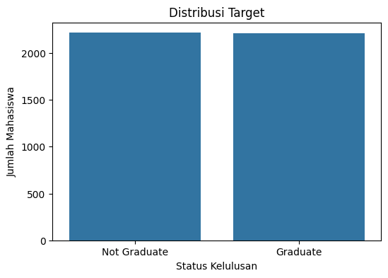
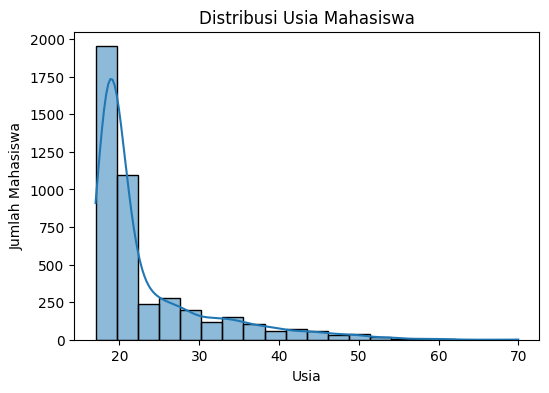
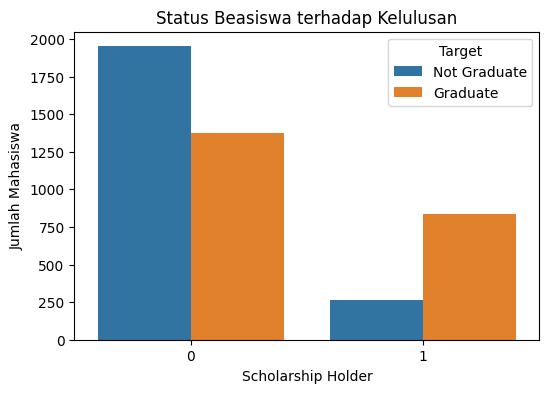
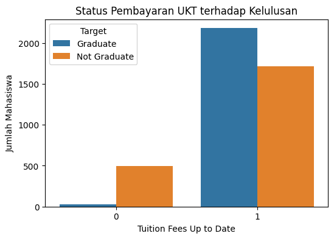
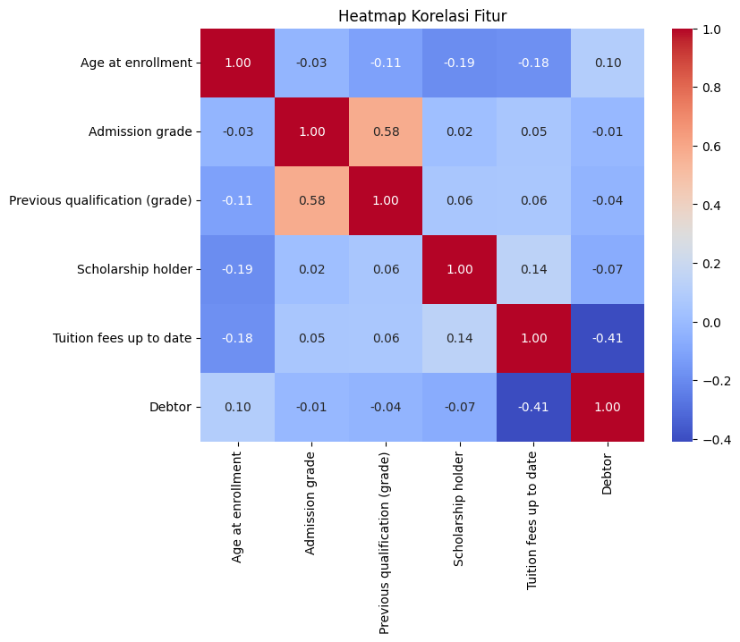
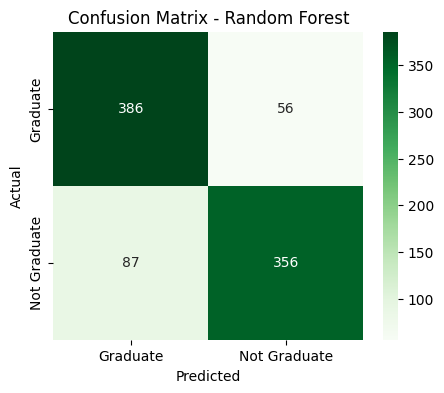

# Prediksi Kelulusan Mahasiswa Menggunakan Algoritma Decision Tree dan Random Forest Berbasis Machine Learning

**Nama Kelompok:** Rovi Aulia (2406093) & Rani Nurcahyani (2406103)

**Domain Proyek:** Educational Data Mining (Prediksi Kelulusan Mahasiswa)

---

# 1. Judul Proyek

Prediksi Kelulusan Mahasiswa Menggunakan Machine Learning Menggunakan Algoritma Decision Tree dan Random Forest.

Proyek ini bertujuan untuk membangun model klasifikasi yang mampu memprediksi apakah seorang mahasiswa akan berhasil menyelesaikan studinya (**Graduate**) atau **Not Graduate** berdasarkan data akademik, sosial, dan ekonomi yang tersedia pada dataset.

Sesuai ketentuan UAS Kecerdasan Buatan, proyek ini menggunakan **dua algoritma Machine Learning** untuk dibandingkan performanya, yaitu:

- **Model Utama** — Random Forest
- **Model Pembanding** — Decision Tree

Kedua model dibangun menggunakan dataset **Predict Students Dropout and Academic Success** yang diperoleh dari Kaggle. Sebelum proses pelatihan model dilakukan, target pada dataset diubah menjadi dua kelas, yaitu **Graduate** dan **Not Graduate**, sedangkan atribut yang berkaitan dengan nilai Semester 1 dan Semester 2 tidak digunakan agar model lebih berfokus pada karakteristik mahasiswa sebelum memperoleh hasil akademik pada semester tersebut.

Selanjutnya, kedua model dievaluasi menggunakan **Confusion Matrix**, **Accuracy**, **Precision**, **Recall**, dan **F1-Score**. Hasil evaluasi digunakan untuk membandingkan performa kedua algoritma sehingga dapat ditentukan model yang paling baik dalam melakukan prediksi kelulusan mahasiswa.

# 2. Business Understanding

## 2.1 Latar Belakang Permasalahan

Pendidikan tinggi memiliki peran penting dalam menghasilkan sumber daya manusia yang berkualitas dan berdaya saing. Salah satu indikator keberhasilan suatu perguruan tinggi adalah tingkat kelulusan mahasiswa. Mahasiswa yang mampu menyelesaikan studi tepat waktu mencerminkan keberhasilan proses pembelajaran, bimbingan akademik, serta dukungan institusi terhadap kegiatan pendidikan. Sebaliknya, tingginya angka keterlambatan kelulusan maupun mahasiswa yang mengalami *dropout* menjadi tantangan yang perlu mendapatkan perhatian karena dapat memengaruhi kualitas institusi, akreditasi program studi, serta efektivitas penyelenggaraan pendidikan.

Permasalahan kelulusan mahasiswa dipengaruhi oleh berbagai faktor yang saling berkaitan. Faktor akademik seperti prestasi belajar, jumlah mata kuliah yang diambil, serta kemampuan mengikuti proses pembelajaran merupakan faktor yang sering dijadikan indikator keberhasilan studi. Namun demikian, faktor non-akademik juga memiliki pengaruh yang signifikan, seperti kondisi ekonomi keluarga, status beasiswa, usia saat memasuki perguruan tinggi, latar belakang pendidikan sebelumnya, hingga kemampuan mahasiswa dalam memenuhi kewajiban administrasi akademik. Kompleksitas hubungan antar faktor tersebut menyebabkan proses identifikasi mahasiswa yang berpotensi mengalami keterlambatan kelulusan atau *dropout* menjadi tidak mudah apabila hanya dilakukan melalui pengamatan secara manual.

Pada umumnya, pihak perguruan tinggi baru mengetahui adanya permasalahan ketika prestasi akademik mahasiswa mulai menurun atau mahasiswa tidak lagi aktif mengikuti kegiatan perkuliahan. Kondisi tersebut menyebabkan tindakan pendampingan sering kali dilakukan ketika permasalahan sudah berkembang lebih jauh. Padahal, apabila potensi risiko tersebut dapat diketahui lebih awal, institusi dapat melakukan berbagai bentuk intervensi, seperti pemberian bimbingan akademik, konseling, pendampingan belajar, maupun bantuan finansial kepada mahasiswa yang membutuhkan. Oleh karena itu, diperlukan suatu pendekatan yang mampu membantu proses identifikasi mahasiswa yang berpotensi tidak menyelesaikan studi secara lebih cepat, objektif, dan berdasarkan data.

Perkembangan Artificial Intelligence (AI), khususnya pada bidang *Machine Learning*, memberikan peluang untuk menyelesaikan permasalahan tersebut melalui pendekatan berbasis data (*data-driven*). Machine Learning memungkinkan komputer mempelajari pola yang terdapat pada data historis mahasiswa, kemudian menggunakan pola tersebut untuk memprediksi kemungkinan status kelulusan mahasiswa pada data baru. Pendekatan ini tidak hanya membantu meningkatkan efisiensi proses analisis data, tetapi juga memberikan dasar pengambilan keputusan yang lebih objektif dibandingkan dengan penilaian berdasarkan intuisi semata.

Dalam proyek ini digunakan dataset **Predict Students Dropout and Academic Success** yang diperoleh dari Kaggle. Dataset tersebut berisi informasi mengenai karakteristik mahasiswa yang meliputi aspek demografis, sosial, ekonomi, serta akademik. Pada penelitian ini, target klasifikasi disederhanakan menjadi dua kelas, yaitu **Graduate** dan **Not Graduate**. Penyederhanaan kelas dilakukan agar proses klasifikasi lebih sederhana dan lebih mudah diinterpretasikan, sekaligus sesuai dengan tujuan utama penelitian, yaitu membedakan mahasiswa yang berhasil menyelesaikan studi dengan mahasiswa yang belum atau tidak berhasil menyelesaikan studi.

Untuk membangun model prediksi digunakan dua algoritma klasifikasi, yaitu **Decision Tree** dan **Random Forest**. Decision Tree dipilih karena mampu menghasilkan aturan keputusan yang mudah dipahami sehingga proses klasifikasi dapat dijelaskan secara intuitif. Sementara itu, Random Forest dipilih karena merupakan pengembangan dari Decision Tree yang memanfaatkan metode *ensemble learning*, sehingga umumnya mampu menghasilkan performa prediksi yang lebih baik serta lebih tahan terhadap masalah *overfitting*. Kedua algoritma tersebut kemudian dibandingkan menggunakan metrik evaluasi seperti Accuracy, Precision, Recall, F1-Score, dan Confusion Matrix untuk menentukan model yang memberikan performa terbaik dalam memprediksi kelulusan mahasiswa.

## 2.2 Literature Review

Penelitian mengenai prediksi kelulusan maupun *dropout* mahasiswa telah banyak dilakukan dengan memanfaatkan teknik *Machine Learning*. Berbagai algoritma klasifikasi digunakan untuk mengidentifikasi mahasiswa yang berisiko tidak menyelesaikan studi sehingga institusi pendidikan dapat melakukan tindakan pencegahan lebih awal. Berikut merupakan beberapa penelitian yang menjadi referensi dalam proyek ini.

### 1. A Study on Dropout Prediction for University Students Using Machine Learning

Penelitian ini bertujuan untuk membangun model prediksi *dropout* mahasiswa menggunakan beberapa algoritma *Machine Learning*. Dataset yang digunakan berasal dari data akademik mahasiswa yang memuat informasi mengenai karakteristik pribadi, kondisi akademik, dan faktor sosial ekonomi mahasiswa. Penelitian membandingkan beberapa algoritma klasifikasi, seperti Decision Tree, Random Forest, Logistic Regression, Support Vector Machine (SVM), dan XGBoost.

Hasil penelitian menunjukkan bahwa algoritma berbasis *ensemble*, khususnya Random Forest dan XGBoost, memberikan performa yang lebih baik dibandingkan algoritma klasifikasi tunggal. Penelitian ini menunjukkan bahwa pemilihan algoritma yang tepat berpengaruh terhadap tingkat akurasi prediksi mahasiswa yang berpotensi mengalami *dropout*. Oleh karena itu, penelitian tersebut menjadi salah satu dasar pemilihan algoritma Random Forest pada proyek ini.

---

### 2. All-Year Dropout Prediction Modeling and Analysis for University Students

Penelitian ini mengembangkan model prediksi *dropout* mahasiswa yang dapat digunakan pada setiap tahun masa studi mahasiswa. Penelitian tidak hanya berfokus pada mahasiswa tingkat akhir, tetapi juga melakukan analisis terhadap mahasiswa sejak awal masa perkuliahan sehingga proses identifikasi risiko dapat dilakukan lebih dini.

Hasil penelitian menunjukkan bahwa pemanfaatan data historis mahasiswa mampu menghasilkan model prediksi dengan tingkat performa yang baik. Selain itu, penelitian juga menegaskan bahwa informasi akademik dan karakteristik mahasiswa memiliki pengaruh yang signifikan terhadap keberhasilan model klasifikasi. Temuan tersebut mendukung penggunaan dataset yang memiliki atribut akademik dan non-akademik seperti pada proyek ini.

---

### 3. Student Dropout Prediction for University with High Precision and Recall

Penelitian ini berfokus pada peningkatan nilai Precision dan Recall dalam proses prediksi mahasiswa yang berpotensi mengalami *dropout*. Beberapa algoritma *Machine Learning* dibandingkan untuk memperoleh model yang mampu mengurangi kesalahan klasifikasi, terutama pada mahasiswa yang benar-benar berisiko.

Hasil penelitian menunjukkan bahwa evaluasi model tidak cukup hanya menggunakan Accuracy, tetapi juga perlu mempertimbangkan Precision, Recall, dan F1-Score. Oleh karena itu, pada proyek ini evaluasi model dilakukan menggunakan beberapa metrik tersebut agar performa kedua algoritma dapat dibandingkan secara lebih komprehensif.

---

### 4. Predicting Student Dropout Based on Machine Learning and Deep Learning: A Systematic Review

Penelitian ini merupakan *systematic literature review* yang membahas berbagai penelitian mengenai prediksi *dropout* mahasiswa menggunakan metode *Machine Learning* maupun *Deep Learning*. Penelitian mengidentifikasi algoritma yang paling sering digunakan, faktor-faktor yang memengaruhi keberhasilan prediksi, serta tantangan yang masih dihadapi dalam penerapan model prediksi pada dunia pendidikan.

Hasil kajian menunjukkan bahwa Random Forest merupakan salah satu algoritma yang paling sering digunakan karena memiliki performa yang tinggi dan relatif stabil pada berbagai jenis dataset. Selain itu, penelitian juga menyimpulkan bahwa kualitas data dan proses *data preprocessing* memiliki pengaruh besar terhadap performa model yang dihasilkan.

---

### 5. Predictive Analytics Study to Determine Undergraduate Students at Risk of Dropout

Penelitian ini menerapkan teknik *predictive analytics* untuk mengidentifikasi mahasiswa yang memiliki risiko tinggi mengalami *dropout*. Berbagai algoritma klasifikasi dibandingkan berdasarkan performa prediksi menggunakan beberapa metrik evaluasi.

Hasil penelitian menunjukkan bahwa pendekatan berbasis *Machine Learning* mampu membantu institusi pendidikan dalam melakukan identifikasi mahasiswa berisiko secara lebih cepat dibandingkan pendekatan konvensional. Penelitian tersebut juga menunjukkan bahwa model prediksi dapat digunakan sebagai sistem pendukung keputusan (*decision support system*) bagi pihak perguruan tinggi dalam menentukan strategi pendampingan mahasiswa.

---

Berdasarkan kelima penelitian tersebut dapat disimpulkan bahwa penerapan *Machine Learning* dalam bidang pendidikan telah memberikan hasil yang menjanjikan untuk membantu memprediksi keberhasilan studi maupun risiko *dropout* mahasiswa. Meskipun demikian, setiap penelitian menggunakan dataset, atribut, serta kombinasi algoritma yang berbeda-beda sehingga performa model yang dihasilkan juga bervariasi.

Pada proyek ini digunakan dataset **Predict Students Dropout and Academic Success** yang diperoleh dari Kaggle dengan melakukan penyederhanaan target menjadi dua kelas, yaitu **Graduate** dan **Not Graduate**. Selain itu, penelitian ini membandingkan dua algoritma klasifikasi, yaitu **Decision Tree** dan **Random Forest**, untuk mengetahui algoritma yang memberikan performa terbaik dalam memprediksi kelulusan mahasiswa berdasarkan data yang digunakan.

## 2.3 Tujuan Proyek

Berdasarkan permasalahan yang telah diuraikan sebelumnya, proyek ini bertujuan untuk membangun model klasifikasi berbasis *Machine Learning* yang mampu memprediksi status kelulusan mahasiswa menggunakan dataset **Predict Students Dropout and Academic Success**. Model yang dibangun diharapkan dapat mengenali pola dari data historis mahasiswa sehingga mampu mengklasifikasikan mahasiswa ke dalam dua kategori, yaitu **Graduate** dan **Not Graduate**.

Secara khusus, tujuan yang ingin dicapai dalam proyek ini adalah sebagai berikut.

1. Mengolah dataset **Predict Students Dropout and Academic Success** dengan melakukan proses *data preprocessing*, termasuk penyederhanaan target menjadi dua kelas (**Graduate** dan **Not Graduate**) serta menghilangkan atribut yang berkaitan dengan nilai Semester 1 dan Semester 2 agar model tidak bergantung pada hasil akademik pada semester tersebut.

2. Membangun model prediksi menggunakan dua algoritma *Machine Learning*, yaitu **Decision Tree** dan **Random Forest**, untuk melakukan klasifikasi status kelulusan mahasiswa.

3. Membandingkan performa kedua algoritma menggunakan metrik evaluasi **Accuracy**, **Precision**, **Recall**, **F1-Score**, dan **Confusion Matrix** sehingga dapat diketahui algoritma yang memberikan hasil prediksi terbaik.

4. Memberikan gambaran mengenai penerapan *Machine Learning* dalam bidang pendidikan, khususnya sebagai alat bantu untuk mengidentifikasi mahasiswa yang berpotensi mengalami keterlambatan kelulusan atau tidak menyelesaikan studi sehingga institusi pendidikan dapat mengambil langkah pendampingan secara lebih dini.

## 2.4 Pengguna Sistem

Model prediksi yang dibangun pada proyek ini dirancang untuk menghasilkan informasi yang dapat dimanfaatkan oleh berbagai pihak di lingkungan perguruan tinggi. Hasil klasifikasi yang diperoleh dari model *Machine Learning* diharapkan dapat membantu proses pengambilan keputusan yang berkaitan dengan peningkatan tingkat kelulusan mahasiswa. Adapun pengguna yang dapat memanfaatkan hasil prediksi tersebut adalah sebagai berikut.

### 1. Program Studi atau Fakultas

Program studi maupun fakultas dapat memanfaatkan hasil prediksi untuk mengidentifikasi mahasiswa yang memiliki potensi mengalami keterlambatan kelulusan atau tidak menyelesaikan studi. Informasi tersebut dapat digunakan sebagai dasar dalam menyusun program pembinaan akademik, evaluasi kurikulum, maupun penyusunan strategi peningkatan kualitas pendidikan.

### 2. Dosen Wali atau Dosen Pembimbing Akademik

Dosen wali memiliki peran dalam melakukan pendampingan akademik kepada mahasiswa. Dengan adanya hasil prediksi dari model *Machine Learning*, dosen wali dapat lebih mudah menentukan mahasiswa yang memerlukan perhatian khusus sehingga proses pembinaan dapat dilakukan lebih cepat dan lebih tepat sasaran.

### 3. Mahasiswa

Apabila model ini dikembangkan menjadi sebuah sistem informasi atau aplikasi, mahasiswa dapat memanfaatkan hasil prediksi sebagai bahan evaluasi terhadap kondisi akademiknya. Informasi tersebut dapat meningkatkan kesadaran mahasiswa untuk memperbaiki proses belajar, meningkatkan prestasi akademik, maupun memanfaatkan layanan akademik yang disediakan oleh perguruan tinggi.

### 4. Pimpinan Perguruan Tinggi

Pimpinan perguruan tinggi dapat menggunakan hasil prediksi sebagai salah satu pendukung pengambilan keputusan (*decision support*). Informasi mengenai jumlah mahasiswa yang diprediksi berpotensi mengalami keterlambatan kelulusan dapat menjadi dasar dalam menyusun kebijakan akademik, program pembinaan mahasiswa, maupun evaluasi terhadap efektivitas proses pembelajaran yang telah berjalan.

Dengan demikian, model prediksi yang dibangun tidak hanya berfungsi sebagai alat klasifikasi, tetapi juga sebagai pendukung pengambilan keputusan berbasis data (*data-driven decision making*) yang dapat membantu meningkatkan kualitas layanan pendidikan di perguruan tinggi.

## 2.4 Pengguna Sistem

Model prediksi yang dibangun pada proyek ini dirancang untuk menghasilkan informasi yang dapat dimanfaatkan oleh berbagai pihak di lingkungan perguruan tinggi. Hasil klasifikasi yang diperoleh dari model *Machine Learning* diharapkan dapat membantu proses pengambilan keputusan yang berkaitan dengan peningkatan tingkat kelulusan mahasiswa. Adapun pengguna yang dapat memanfaatkan hasil prediksi tersebut adalah sebagai berikut.

### 1. Program Studi atau Fakultas

Program studi maupun fakultas dapat memanfaatkan hasil prediksi untuk mengidentifikasi mahasiswa yang memiliki potensi mengalami keterlambatan kelulusan atau tidak menyelesaikan studi. Informasi tersebut dapat digunakan sebagai dasar dalam menyusun program pembinaan akademik, evaluasi kurikulum, maupun penyusunan strategi peningkatan kualitas pendidikan.

### 2. Dosen Wali atau Dosen Pembimbing Akademik

Dosen wali memiliki peran dalam melakukan pendampingan akademik kepada mahasiswa. Dengan adanya hasil prediksi dari model *Machine Learning*, dosen wali dapat lebih mudah menentukan mahasiswa yang memerlukan perhatian khusus sehingga proses pembinaan dapat dilakukan lebih cepat dan lebih tepat sasaran.

### 3. Mahasiswa

Apabila model ini dikembangkan menjadi sebuah sistem informasi atau aplikasi, mahasiswa dapat memanfaatkan hasil prediksi sebagai bahan evaluasi terhadap kondisi akademiknya. Informasi tersebut dapat meningkatkan kesadaran mahasiswa untuk memperbaiki proses belajar, meningkatkan prestasi akademik, maupun memanfaatkan layanan akademik yang disediakan oleh perguruan tinggi.

### 4. Pimpinan Perguruan Tinggi

Pimpinan perguruan tinggi dapat menggunakan hasil prediksi sebagai salah satu pendukung pengambilan keputusan (*decision support*). Informasi mengenai jumlah mahasiswa yang diprediksi berpotensi mengalami keterlambatan kelulusan dapat menjadi dasar dalam menyusun kebijakan akademik, program pembinaan mahasiswa, maupun evaluasi terhadap efektivitas proses pembelajaran yang telah berjalan.

Dengan demikian, model prediksi yang dibangun tidak hanya berfungsi sebagai alat klasifikasi, tetapi juga sebagai pendukung pengambilan keputusan berbasis data (*data-driven decision making*) yang dapat membantu meningkatkan kualitas layanan pendidikan di perguruan tinggi.

## 2.5 Solusi dan Manfaat Implementasi Artificial Intelligence

Artificial Intelligence (AI), khususnya *Machine Learning*, menawarkan pendekatan yang efektif dalam menyelesaikan permasalahan prediksi kelulusan mahasiswa. Berbeda dengan analisis konvensional yang umumnya dilakukan secara manual, *Machine Learning* mampu mempelajari pola dari data historis mahasiswa sehingga dapat menghasilkan prediksi secara otomatis terhadap data baru.

Pada proyek ini digunakan dua algoritma klasifikasi, yaitu **Decision Tree** dan **Random Forest**. Decision Tree dipilih karena mampu menghasilkan aturan keputusan yang mudah dipahami dan divisualisasikan sehingga proses klasifikasi dapat dijelaskan secara sederhana. Sementara itu, Random Forest digunakan karena merupakan metode *ensemble learning* yang menggabungkan banyak pohon keputusan untuk meningkatkan akurasi prediksi serta mengurangi risiko *overfitting*.

Implementasi kedua algoritma tersebut diharapkan mampu menghasilkan model klasifikasi yang memiliki performa baik dalam membedakan mahasiswa yang diprediksi **Graduate** dan **Not Graduate**. Performa model kemudian dievaluasi menggunakan beberapa metrik, yaitu Accuracy, Precision, Recall, F1-Score, serta Confusion Matrix sehingga dapat diketahui algoritma yang memberikan hasil prediksi terbaik.

Penerapan Artificial Intelligence dalam bidang pendidikan memberikan berbagai manfaat, di antaranya membantu institusi pendidikan dalam mengidentifikasi mahasiswa yang berisiko mengalami keterlambatan kelulusan, meningkatkan efektivitas proses pendampingan akademik, mendukung pengambilan keputusan berbasis data, serta mengoptimalkan pemanfaatan sumber daya yang dimiliki perguruan tinggi. Selain itu, penggunaan model prediksi juga dapat menjadi langkah awal dalam pengembangan sistem *Early Warning System* yang mampu memberikan peringatan dini terhadap mahasiswa yang membutuhkan perhatian khusus selama proses perkuliahan.

# 3. Data Understanding

## 3.1 Pengumpulan Data

Dataset yang digunakan dalam proyek ini adalah **Predict Students Dropout and Academic Success** yang diperoleh dari platform Kaggle. Dataset ini dipilih karena menyediakan data mahasiswa yang mencakup aspek demografis, sosial, ekonomi, dan akademik sehingga sesuai untuk membangun model prediksi kelulusan mahasiswa menggunakan algoritma *Machine Learning*.

Pada penelitian ini, dataset digunakan sebagai data utama untuk proses klasifikasi dengan target akhir berupa dua kelas, yaitu **Graduate** dan **Not Graduate**.

---

## 3.2 Sumber Dataset

Dataset diperoleh dari platform Kaggle dengan nama **Predict Students Dropout and Academic Success**. Dataset ini telah banyak digunakan dalam penelitian di bidang *Educational Data Mining* karena memiliki jumlah data yang cukup serta atribut yang relevan untuk menganalisis faktor-faktor yang memengaruhi keberhasilan studi mahasiswa.

Informasi umum dataset ditunjukkan pada Tabel 3.1.

### Tabel 3.1 Informasi Dataset

| Informasi | Keterangan |
|------------|------------|
| Nama Dataset | Predict Students Dropout and Academic Success |
| Sumber | Kaggle |
| Jumlah Data | 4.424 |
| Jumlah Atribut | 37 atribut |
| Target Awal | Graduate, Dropout, Enrolled |
| Target Akhir | Graduate, Not Graduate |

---

## 3.3 Karakteristik Dataset

Dataset terdiri atas 4.424 data mahasiswa dengan 37 atribut yang merepresentasikan karakteristik mahasiswa, mulai dari informasi pribadi, kondisi sosial ekonomi, hingga data akademik. Target pada dataset awal terdiri atas tiga kelas, yaitu **Graduate**, **Dropout**, dan **Enrolled**.

Sesuai tujuan penelitian, target diubah menjadi dua kelas dengan menggabungkan kelas **Dropout** dan **Enrolled** menjadi **Not Graduate**. Perubahan ini dilakukan agar model berfokus pada proses klasifikasi biner sehingga hasil prediksi lebih mudah dianalisis.

Selain itu, atribut yang berkaitan dengan nilai Semester 1 dan Semester 2 tidak digunakan dalam penelitian ini agar model tidak bergantung pada hasil akademik selama perkuliahan, melainkan pada karakteristik mahasiswa sebelum memperoleh hasil belajar tersebut.

---

## 3.4 Variabel yang Digunakan

Penelitian ini menggunakan beberapa variabel yang dianggap relevan terhadap proses prediksi kelulusan mahasiswa. Seluruh atribut yang berkaitan dengan nilai Semester 1 dan Semester 2 dikeluarkan dari proses pemodelan.

Tabel berikut menunjukkan beberapa variabel yang digunakan dalam penelitian.

### Tabel 3.2 Variabel yang Digunakan

| Variabel | Deskripsi |
|-----------|-----------|
| Marital status | Status pernikahan mahasiswa |
| Application mode | Jalur masuk perguruan tinggi |
| Application order | Urutan pilihan program studi |
| Course | Program studi |
| Previous qualification | Pendidikan terakhir |
| Admission grade | Nilai saat masuk |
| Nationality | Kewarganegaraan |
| Mother's qualification | Pendidikan ibu |
| Father's qualification | Pendidikan ayah |
| Mother's occupation | Pekerjaan ibu |
| Father's occupation | Pekerjaan ayah |
| Displaced | Status mahasiswa perantau |
| Educational special needs | Kebutuhan pendidikan khusus |
| Debtor | Status tunggakan biaya pendidikan |
| Tuition fees up to date | Status pembayaran biaya kuliah |
| Gender | Jenis kelamin |
| Scholarship holder | Status penerima beasiswa |
| Age at enrollment | Usia saat masuk perguruan tinggi |
| International | Status mahasiswa internasional |

Berdasarkan hasil *Data Understanding*, dataset memiliki jumlah data yang memadai, kualitas data yang baik, serta variabel yang relevan untuk membangun model prediksi kelulusan mahasiswa menggunakan algoritma Decision Tree dan Random Forest.

# 4. Exploratory Data Analysis (EDA)

Exploratory Data Analysis (EDA) dilakukan untuk memahami karakteristik dataset sebelum proses pemodelan. Tahap ini bertujuan untuk mengidentifikasi pola data, melihat distribusi setiap variabel, mengetahui hubungan antar fitur, serta menemukan informasi penting yang dapat memengaruhi proses prediksi kelulusan mahasiswa.

Pada penelitian ini, visualisasi data dibuat menggunakan bahasa pemrograman Python pada Google Colab dengan bantuan pustaka Matplotlib dan Seaborn.

## 4.1 Distribusi Target

Visualisasi distribusi target dilakukan untuk mengetahui proporsi jumlah data pada masing-masing kelas setelah proses transformasi target menjadi dua kelas, yaitu **Graduate** dan **Not Graduate**.

> **Masukkan gambar hasil visualisasi distribusi target dari Google Colab di bawah ini.**

  

<b>Gambar 4.1 Distribusi Target</b>

Berdasarkan visualisasi tersebut, jumlah data pada kelas **Graduate** dan **Not Graduate** relatif seimbang. Kondisi ini menguntungkan dalam proses pelatihan model karena mengurangi risiko terjadinya *class imbalance* yang dapat menyebabkan model lebih cenderung memprediksi salah satu kelas dibandingkan kelas lainnya.

## 4.2 Distribusi Usia Mahasiswa

Visualisasi usia dilakukan untuk mengetahui sebaran usia mahasiswa pada saat melakukan pendaftaran di perguruan tinggi.

> **Masukkan grafik distribusi usia dari Google Colab di bawah ini.**

  

<b>Gambar 4.2 Distribusi Usia Mahasiswa</b>

Grafik menunjukkan bahwa sebagian besar mahasiswa berada pada rentang usia awal memasuki perguruan tinggi. Meskipun demikian, terdapat beberapa mahasiswa dengan usia yang lebih tinggi sehingga menunjukkan bahwa dataset memiliki variasi karakteristik usia yang cukup beragam.

## 4.3 Status Penerima Beasiswa

Visualisasi ini bertujuan untuk mengetahui proporsi mahasiswa yang menerima beasiswa dan yang tidak menerima beasiswa.

> **Masukkan grafik Scholarship Holder dari Google Colab di bawah ini.**

  

<b>Gambar 4.3 Status Penerima Beasiswa</b>

Berdasarkan grafik tersebut, terlihat bahwa sebagian besar mahasiswa tidak menerima beasiswa. Variabel ini diperkirakan memiliki pengaruh terhadap status kelulusan karena berkaitan dengan kondisi ekonomi maupun prestasi akademik mahasiswa.

## 4.4 Status Pembayaran Biaya Kuliah

Visualisasi dilakukan untuk mengetahui distribusi mahasiswa berdasarkan status pembayaran biaya kuliah (*Tuition Fees Up To Date*).

> **Masukkan grafik Tuition Fees Up To Date dari Google Colab di bawah ini.**

  

<b>Gambar 4.4 Status Pembayaran Biaya Kuliah</b>

Grafik menunjukkan bahwa sebagian besar mahasiswa memiliki status pembayaran biaya kuliah yang telah diperbarui. Variabel ini diperkirakan menjadi salah satu faktor yang dapat memengaruhi keberhasilan mahasiswa dalam menyelesaikan studi.

## 4.5 Korelasi Antar Variabel

Analisis korelasi dilakukan untuk mengetahui hubungan antar variabel yang digunakan dalam penelitian. Korelasi divisualisasikan menggunakan *heatmap* sehingga hubungan antar fitur dapat diamati dengan lebih mudah.

> **Masukkan heatmap hasil Google Colab di bawah ini.**

  

<b>Gambar 4.5 Heatmap Korelasi Antar Variabel</b>

Berdasarkan hasil visualisasi, sebagian besar variabel tidak memiliki korelasi yang sangat tinggi satu sama lain. Hal ini menunjukkan bahwa setiap variabel memberikan informasi yang berbeda dan berpotensi memberikan kontribusi terhadap proses klasifikasi. Beberapa variabel menunjukkan hubungan yang lebih kuat dibandingkan variabel lainnya, namun tidak ditemukan korelasi yang sangat tinggi sehingga risiko terjadinya multikolinearitas relatif kecil.

# 5. Data Preparation

Tahap *Data Preparation* dilakukan untuk mempersiapkan dataset sebelum digunakan pada proses pemodelan. Proses ini bertujuan agar data memiliki format yang sesuai dengan kebutuhan algoritma *Machine Learning* sehingga model dapat dilatih dengan lebih optimal. Tahapan yang dilakukan pada penelitian ini meliputi transformasi target, seleksi fitur, pemisahan data, dan proses *encoding*.

---

## 5.1 Transformasi Target

Dataset asli memiliki tiga kelas target, yaitu **Graduate**, **Dropout**, dan **Enrolled**. Agar penelitian berfokus pada klasifikasi biner, dilakukan transformasi target dengan menggabungkan kelas **Dropout** dan **Enrolled** menjadi **Not Graduate**.

Transformasi tersebut menghasilkan dua kelas akhir, yaitu:

| Target Awal | Target Baru |
|-------------|-------------|
| Graduate | Graduate |
| Dropout | Not Graduate |
| Enrolled | Not Graduate |

Transformasi ini dilakukan agar model lebih mudah membedakan mahasiswa yang berhasil menyelesaikan studi dengan mahasiswa yang belum atau tidak berhasil menyelesaikan studi.

---

## 5.2 Seleksi Fitur

Pada penelitian ini dilakukan seleksi fitur dengan menghapus seluruh atribut yang berkaitan dengan nilai Semester 1 dan Semester 2. Penghapusan dilakukan agar model tidak bergantung pada hasil akademik selama perkuliahan, tetapi lebih berfokus pada karakteristik mahasiswa sebelum memperoleh nilai pada semester tersebut.

Fitur yang digunakan terdiri atas atribut demografis, sosial, ekonomi, serta beberapa informasi akademik awal yang dianggap relevan terhadap proses prediksi kelulusan mahasiswa.

---

## 5.3 Label Encoding

Target klasifikasi yang telah dibentuk kemudian dikonversi ke dalam bentuk numerik menggunakan **LabelEncoder** dari pustaka Scikit-learn.

Proses ini dilakukan karena algoritma Decision Tree dan Random Forest memerlukan target dalam bentuk numerik sebelum proses pelatihan model dilakukan.

---

## 5.4 Pemisahan Data

Setelah proses transformasi selesai, dataset dibagi menjadi data latih (*training data*) dan data uji (*testing data*) menggunakan fungsi `train_test_split`.

Pembagian data dilakukan dengan rasio:

- **80%** data latih (*training data*)
- **20%** data uji (*testing data*)

Data latih digunakan untuk membangun model, sedangkan data uji digunakan untuk mengevaluasi performa model terhadap data yang belum pernah dipelajari sebelumnya.

---

## 5.5 Hasil Data Preparation

Setelah seluruh tahapan *Data Preparation* selesai dilakukan, dataset siap digunakan pada proses pembangunan model menggunakan algoritma Decision Tree dan Random Forest. Data yang dihasilkan telah memiliki target dalam bentuk klasifikasi biner, fitur yang relevan, serta format numerik yang sesuai dengan kebutuhan algoritma *Machine Learning*.

# 6. Modeling

Tahap *Modeling* merupakan proses membangun model klasifikasi menggunakan algoritma *Machine Learning*. Pada penelitian ini digunakan dua algoritma, yaitu **Decision Tree** dan **Random Forest**. Kedua algoritma dipilih untuk dibandingkan performanya dalam memprediksi status kelulusan mahasiswa berdasarkan data yang telah diproses pada tahap sebelumnya.

---

## 6.1 Pemilihan Algoritma

Penelitian ini menggunakan dua algoritma klasifikasi yang memiliki karakteristik berbeda, yaitu **Decision Tree** dan **Random Forest**.

### Decision Tree

Decision Tree merupakan algoritma klasifikasi yang bekerja dengan membentuk struktur pohon keputusan berdasarkan atribut yang paling berpengaruh terhadap data. Setiap percabangan merepresentasikan aturan keputusan yang digunakan untuk menentukan kelas akhir suatu data.

Kelebihan Decision Tree adalah mudah dipahami, mudah divisualisasikan, serta mampu menangani data numerik maupun kategorikal. Namun, algoritma ini memiliki kelemahan berupa kecenderungan mengalami *overfitting* apabila pohon yang dihasilkan terlalu kompleks.

### Random Forest

Random Forest merupakan metode *ensemble learning* yang dibangun dari sekumpulan Decision Tree. Setiap pohon dibentuk menggunakan sampel data dan kombinasi fitur yang berbeda, kemudian hasil prediksi ditentukan berdasarkan suara terbanyak (*majority voting*).

Dibandingkan Decision Tree, Random Forest umumnya menghasilkan performa yang lebih baik karena mampu mengurangi risiko *overfitting* serta memiliki tingkat generalisasi yang lebih tinggi terhadap data baru.

---

## 6.2 Implementasi Model

Model dibangun menggunakan pustaka **Scikit-learn** pada Python melalui Google Colab.

Tahapan implementasi meliputi:

1. Menentukan data latih dan data uji.
2. Melatih model Decision Tree menggunakan data latih.
3. Melatih model Random Forest menggunakan data latih.
4. Menghasilkan prediksi pada data uji menggunakan kedua model.
5. Membandingkan hasil prediksi menggunakan metrik evaluasi.

Seluruh proses pelatihan dilakukan menggunakan dataset yang telah melalui tahap *Data Preparation* sehingga setiap model menerima data yang sama dan dapat dibandingkan secara adil.

---

## 6.3 Perbandingan Model

Perbandingan model dilakukan berdasarkan hasil evaluasi pada data uji. Evaluasi menggunakan beberapa metrik, yaitu Accuracy, Precision, Recall, dan F1-Score.

Selain itu, analisis juga dilakukan menggunakan Confusion Matrix untuk mengetahui kemampuan masing-masing model dalam mengklasifikasikan mahasiswa ke dalam kelas **Graduate** dan **Not Graduate**.

Hasil evaluasi akan dibahas secara lebih rinci pada Bab 7.

---

## 6.4 Alasan Pemilihan Dua Algoritma

Decision Tree dipilih karena memiliki proses klasifikasi yang sederhana dan mudah dipahami, sehingga hasil prediksi dapat dijelaskan melalui aturan keputusan yang terbentuk.

Random Forest dipilih karena merupakan pengembangan dari Decision Tree yang mampu meningkatkan akurasi melalui pendekatan *ensemble learning*. Dengan membandingkan kedua algoritma tersebut, penelitian ini dapat mengetahui apakah penggunaan metode *ensemble* memberikan peningkatan performa dibandingkan penggunaan satu pohon keputusan.

# 7. Evaluation

Tahap evaluasi dilakukan untuk mengukur performa model yang telah dibangun dalam memprediksi status kelulusan mahasiswa. Pada penelitian ini, evaluasi dilakukan menggunakan beberapa metrik, yaitu **Accuracy**, **Precision**, **Recall**, **F1-Score**, serta **Confusion Matrix**. Selain itu, hasil evaluasi dari algoritma Decision Tree dan Random Forest dibandingkan untuk mengetahui model yang memiliki performa terbaik.

---

## 7.1 Evaluasi Decision Tree

Hasil evaluasi model Decision Tree menunjukkan bahwa model mampu melakukan klasifikasi dengan tingkat akurasi yang cukup baik. Nilai evaluasi yang diperoleh ditunjukkan pada Tabel 7.1.

### Tabel 7.1 Hasil Evaluasi Decision Tree

| Metrik | Nilai |
|---------|-------:|
| Accuracy | 75,48% |
| Precision | 76,04% |
| Recall | 74,49% |
| F1-Score | 75,26% |

> **Masukkan gambar Confusion Matrix Decision Tree di bawah ini.**

  

<b>Gambar 7.1 Confusion Matrix Decision Tree</b>

Berdasarkan hasil evaluasi, algoritma Decision Tree memperoleh **Accuracy sebesar 75,48%**. Nilai Precision, Recall, dan F1-Score yang relatif seimbang menunjukkan bahwa model mampu mengklasifikasikan kedua kelas dengan cukup baik. Namun, masih terdapat sejumlah data yang salah diklasifikasikan sehingga performa model masih dapat ditingkatkan.

---

## 7.2 Evaluasi Random Forest

Hasil evaluasi menggunakan algoritma Random Forest menunjukkan peningkatan performa dibandingkan Decision Tree. Nilai evaluasi ditunjukkan pada Tabel 7.2.

### Tabel 7.2 Hasil Evaluasi Random Forest

| Metrik | Nilai |
|---------|-------:|
| Accuracy | 83,84% |
| Precision | 86,41% |
| Recall | 80,36% |
| F1-Score | 83,27% |

> **Masukkan gambar Confusion Matrix Random Forest di bawah ini.**

  

<b>Gambar 7.2 Confusion Matrix Random Forest</b>

Hasil evaluasi menunjukkan bahwa algoritma Random Forest memperoleh **Accuracy sebesar 83,84%**, lebih tinggi dibandingkan Decision Tree. Nilai Precision yang tinggi menunjukkan bahwa model mampu memberikan prediksi positif dengan tingkat ketepatan yang baik, sedangkan nilai Recall menunjukkan bahwa sebagian besar data berhasil dikenali dengan benar. Nilai F1-Score sebesar **83,27%** menunjukkan keseimbangan yang baik antara Precision dan Recall.

---

## 7.3 Perbandingan Model

Untuk mempermudah analisis, hasil evaluasi kedua algoritma dibandingkan pada tabel berikut.

### Tabel 7.3 Perbandingan Performa Model

| Metrik | Decision Tree | Random Forest |
|---------|--------------:|--------------:|
| Accuracy | 75,48% | **83,84%** |
| Precision | 76,04% | **86,41%** |
| Recall | 74,49% | **80,36%** |
| F1-Score | 75,26% | **83,27%** |

Berdasarkan hasil perbandingan tersebut, algoritma **Random Forest** menghasilkan performa yang lebih baik pada seluruh metrik evaluasi. Peningkatan akurasi sekitar **8,36%** dibandingkan Decision Tree menunjukkan bahwa pendekatan *ensemble learning* mampu meningkatkan kemampuan model dalam melakukan klasifikasi terhadap data mahasiswa.

Dengan demikian, **Random Forest dipilih sebagai model terbaik** pada penelitian ini karena memberikan hasil prediksi yang lebih akurat dan lebih stabil dibandingkan Decision Tree.

# 8. Kesimpulan dan Rekomendasi

## 8.1 Kesimpulan

Berdasarkan hasil penelitian yang telah dilakukan, dapat disimpulkan bahwa algoritma *Machine Learning* mampu digunakan untuk memprediksi status kelulusan mahasiswa menggunakan dataset **Predict Students Dropout and Academic Success**.

Pada penelitian ini dilakukan perubahan target menjadi dua kelas, yaitu **Graduate** dan **Not Graduate**, serta menghapus atribut yang berkaitan dengan nilai Semester 1 dan Semester 2 agar model tidak bergantung pada hasil akademik selama perkuliahan.

Dua algoritma yang digunakan, yaitu **Decision Tree** dan **Random Forest**, berhasil membangun model klasifikasi dengan performa yang berbeda. Berdasarkan hasil evaluasi, algoritma Random Forest memberikan performa terbaik dengan nilai **Accuracy sebesar 83,84%**, sedangkan Decision Tree memperoleh **Accuracy sebesar 75,48%**.

Hasil tersebut menunjukkan bahwa pendekatan *ensemble learning* pada Random Forest mampu meningkatkan kemampuan model dalam memprediksi status kelulusan mahasiswa dibandingkan penggunaan satu pohon keputusan pada Decision Tree.

---

## 8.2 Keterbatasan Penelitian

Penelitian ini masih memiliki beberapa keterbatasan, di antaranya:

- Dataset yang digunakan berasal dari satu sumber sehingga hasil penelitian belum tentu dapat langsung diterapkan pada seluruh perguruan tinggi.
- Penelitian hanya membandingkan dua algoritma klasifikasi, yaitu Decision Tree dan Random Forest.
- Penelitian belum melakukan optimasi parameter (*hyperparameter tuning*) sehingga performa model masih dapat ditingkatkan.

---

## 8.3 Rekomendasi

Untuk penelitian selanjutnya, beberapa hal yang dapat dilakukan antara lain:

1. Menggunakan dataset yang lebih besar dan berasal dari beberapa perguruan tinggi.
2. Membandingkan algoritma lain seperti XGBoost, LightGBM, atau Support Vector Machine (SVM).
3. Melakukan *hyperparameter tuning* untuk memperoleh performa model yang lebih optimal.
4. Mengembangkan model menjadi sistem prediksi berbasis web sehingga dapat dimanfaatkan oleh pihak perguruan tinggi sebagai pendukung pengambilan keputusan.
